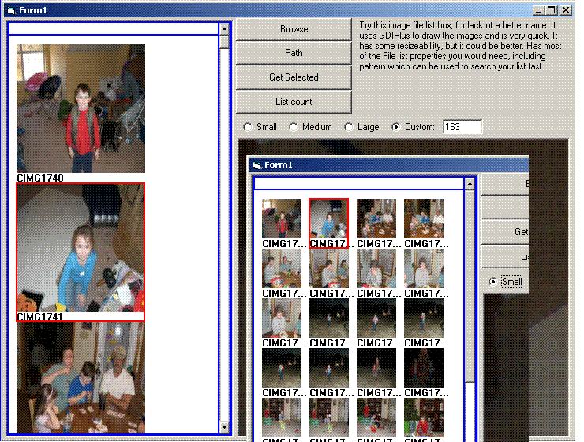



## Image File List

### Description

update 07-17-08

Fixed a bug I caused fixing the last bug.Sorry for the bad upload.

update 07-16-08

fixed a bug with path property pointed out by Ed Wilk and Rodger Gilchrist. Thanks.

update 07-13-08

A few changes addressed in the ucThumbs code, most notable is saving the thumb image in an array for faster drawing.

update 03-03-08

Added auto size and maintain ratio to the thumbs.

also changed the way text is writen. I'm working on unicode.

Update 02-27-08

fixed a few bugs in the code and added some key events along with keyboard shortcuts. You cna find info on the changes at the top of the UC code module.

This is an image file list box. It has a lot of the same properties of the file list. It also has a few properties of its own. A built in right click menu with (Copy, Delete, Move, Rename, Browse for folder, and a File Properties option). Update: found a few problems I fixed. And also I thought since I wrote the code it would be easier for me to update it to do different size thumbs. I couldn't decide on user defined or optional set sizes so I did both.I also added them to the menu so you can change the size at runtime. I'm working on comments and cleaning the code. This may take a few days as I'm quite busy these days. Please let me know if you find any errors in the code or need something added. Thanks!

02-22-08

fixed some problems pointed out by users, credit an reports given in uc code. Thanks for the comments.

added runtime resizeability to the Usercontrol
 
### More Info
 

             |
---                |---
**Submitted On**   |2008-07-17 11:36:14
**By**             |[Russell Sanders](https://github.com/Planet-Source-Code/PSCIndex/blob/master/ByAuthor/russell-sanders.md)
**Level**          |Beginner
**User Rating**    |5.0 (40 globes from 8 users)
**Compatibility**  |VB 6\.0
**Category**       |[Custom Controls/ Forms/  Menus](https://github.com/Planet-Source-Code/PSCIndex/blob/master/ByCategory/custom-controls-forms-menus__1-4.md)
**World**          |[Visual Basic](https://github.com/Planet-Source-Code/PSCIndex/blob/master/ByWorld/visual-basic.md)
**Archive File**   |[Image\_File2120887172008\.zip](https://github.com/Planet-Source-Code/russell-sanders-image-file-list__1-70122/archive/master.zip)

